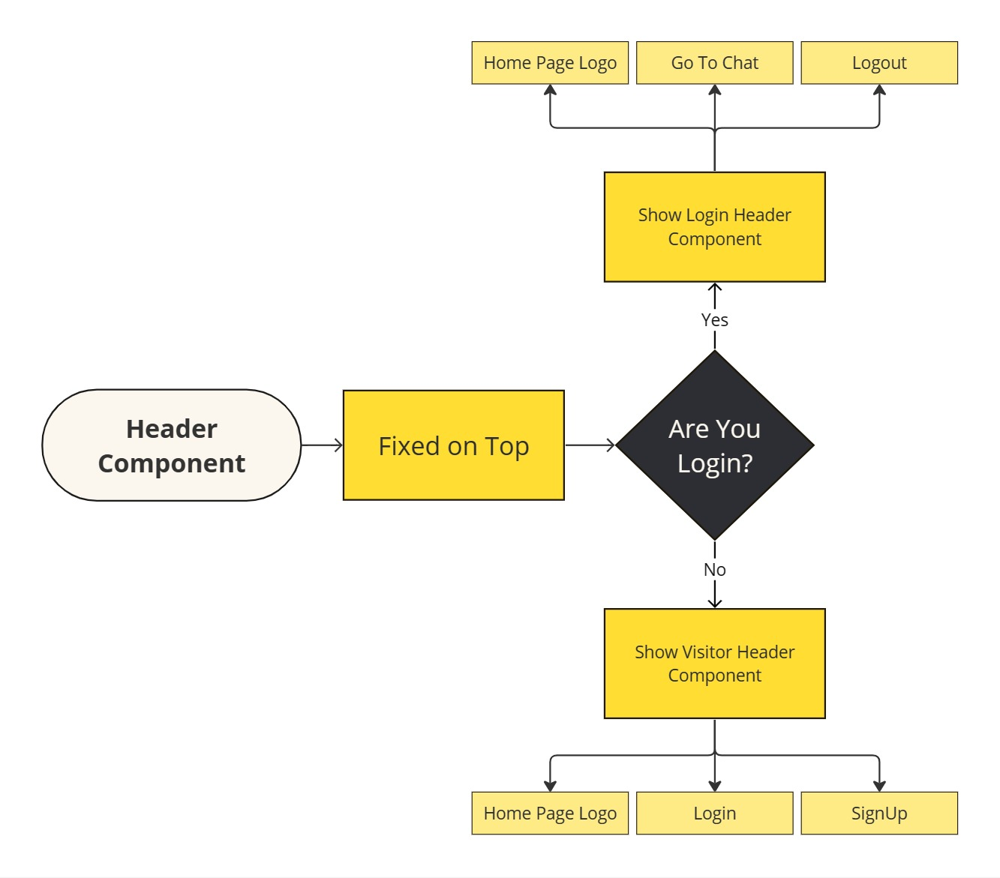
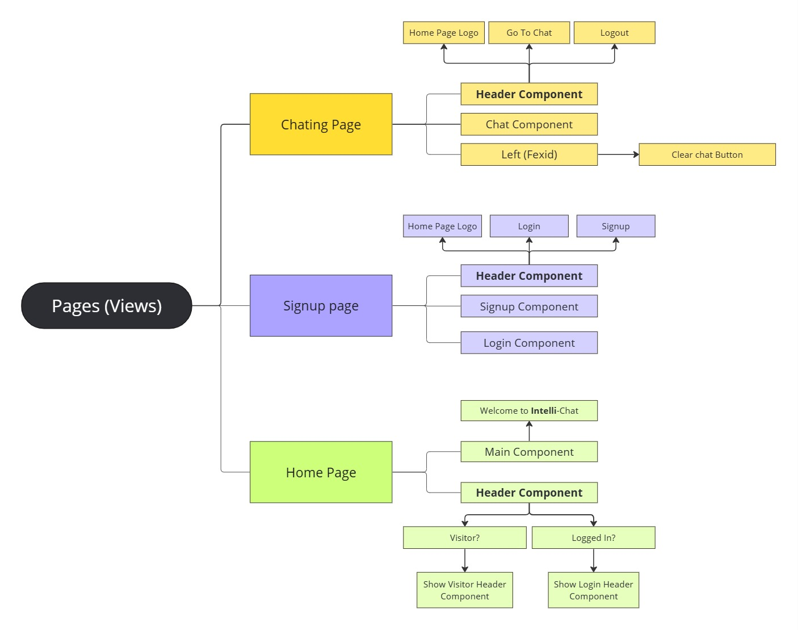

# IntelliChat (MERN) 

IntelliChat is a modern chat application developed using React components, Material UI (MUI), Vite, and integrated with the API of ChatGPT for advanced conversational capabilities. The project focuses on delivering a seamless chatting experience with an intuitive user interface, efficient backend architecture, and responsive design.

## [Live Link]()

## [Video Demo]()

## Screenshots




## Planning
<p align="center">
  
</p>
<p align="center">
  
</p>


## Features

- **Modern React Components**: Utilizes React components to create a dynamic and interactive user interface.
- **Material UI (MUI)**: Integrates the Material UI library for designing beautiful and responsive UI components.
- **Vite**: Utilizes Vite for fast and efficient development builds.
- **ChatGPT API Integration**: Integrates the ChatGPT API for advanced conversational functionalities.
- **Responsive Design**: Ensures seamless usability across various devices with responsive design principles.
- **Efficient Backend**: Developed with a robust backend architecture by Abdulrahman Mohamed.
- **Intuitive Frontend**: Designed with a user-friendly interface by Mahmoud Mansy.

## Getting Started

To run IntelliChat locally, follow these steps:

1. Clone the repository:

   ```bash
   git clone https://github.com/MMansy19/IntelliChat.git
   ```

2. Navigate to the project directory:

   ```bash
   cd IntelliChat
   ```

3. Install dependencies:

   ```bash
   npm install
   ```

4. Configure environment variables:

   - Create a `.env` file based on the provided `.env.example`.
   - Add necessary environment variables for API keys, endpoints, etc.

5. Start the development server:

   ```bash
   npm start
   ```

6. Access IntelliChat in your browser at `http://localhost:3000`.


## Project Contributors 🤝

| Developer Name             | Role                 | GitHub                                             | LinkedIn                                           |
|-------------------------|----------------------|----------------------------------------------------|----------------------------------------------------|
| **Mahmoud Mansy**       | Frontend Developer   | [GitHub](https://github.com/MMansy19)         | [LinkedIn](https://www.linkedin.com/in/mahmoud-mansy-a189a5232/) |
| **Abdulrahman Mohamed** | Backend Developer    | [GitHub](https://github.com/abdomohamed96)   | [LinkedIn](https://www.linkedin.com/in/abdelrahman-mohamed-b7944123a/) |


## License

This project is licensed under the [MIT License](LICENSE).


